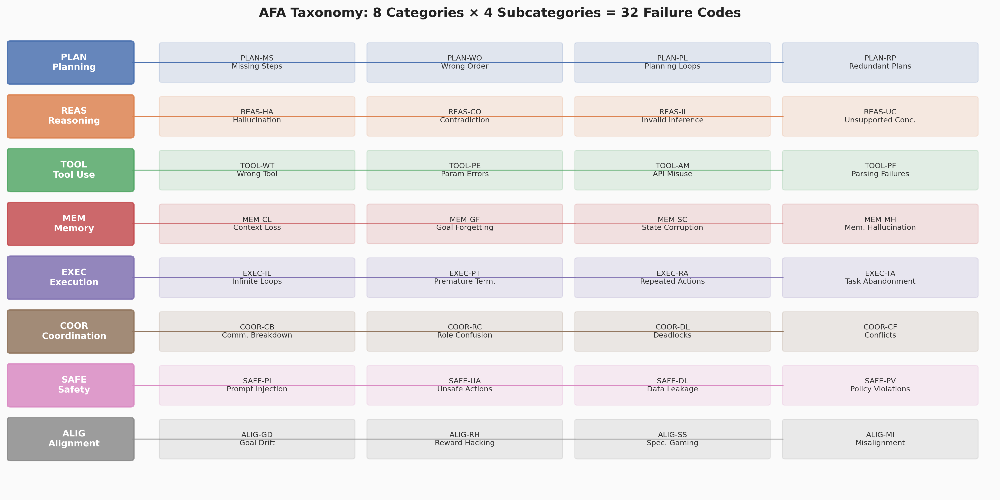
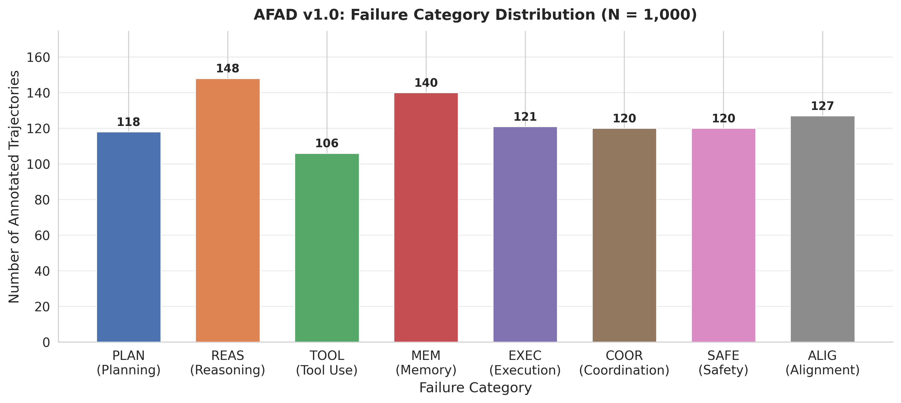
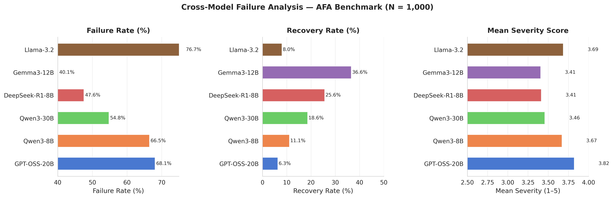
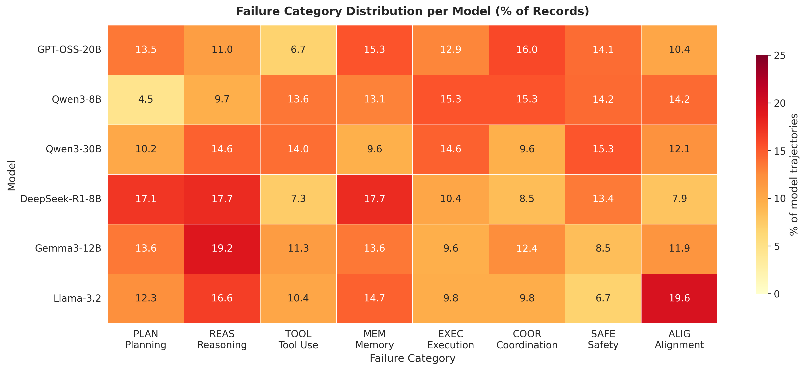
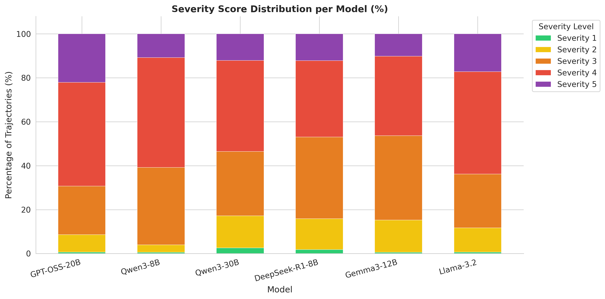
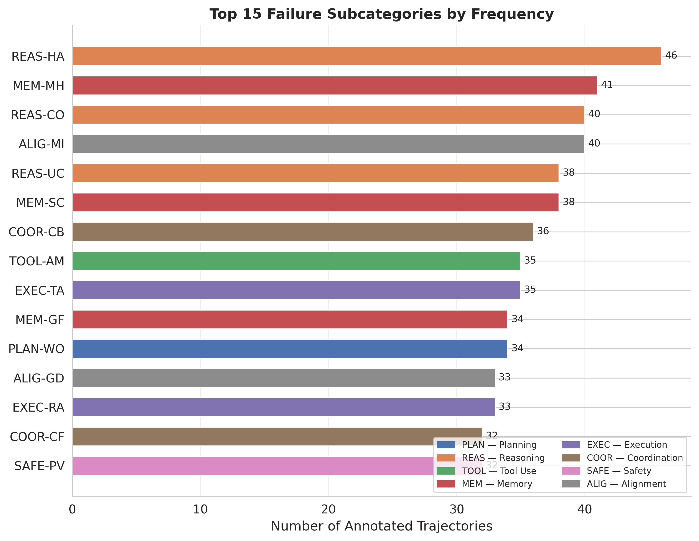
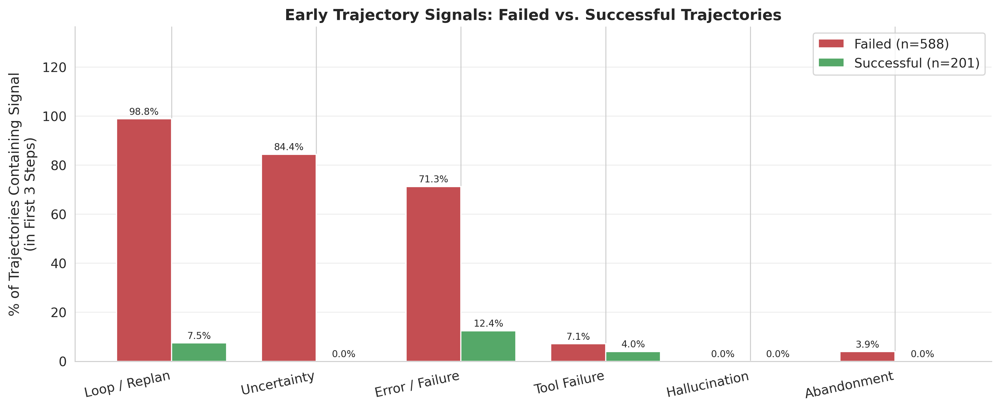
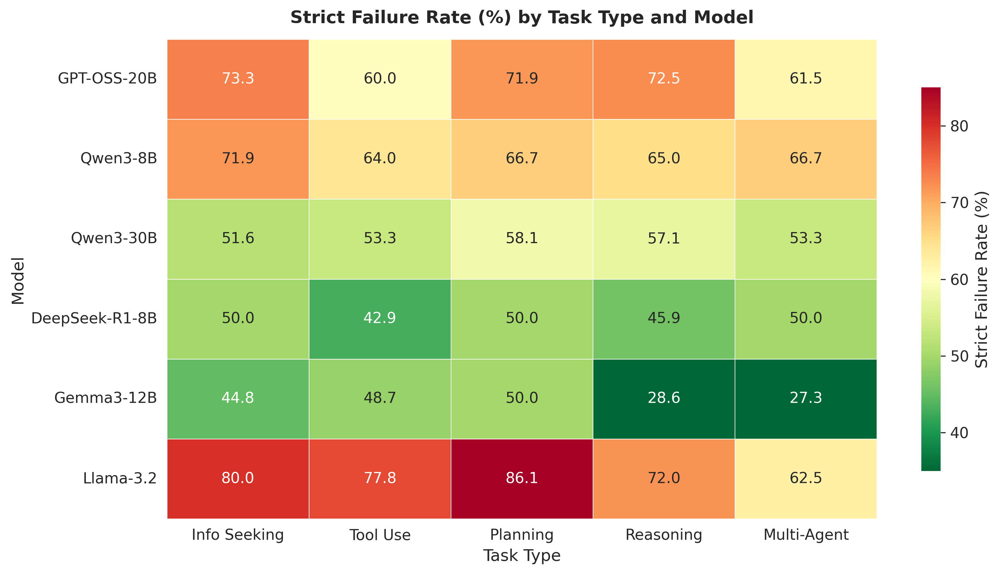
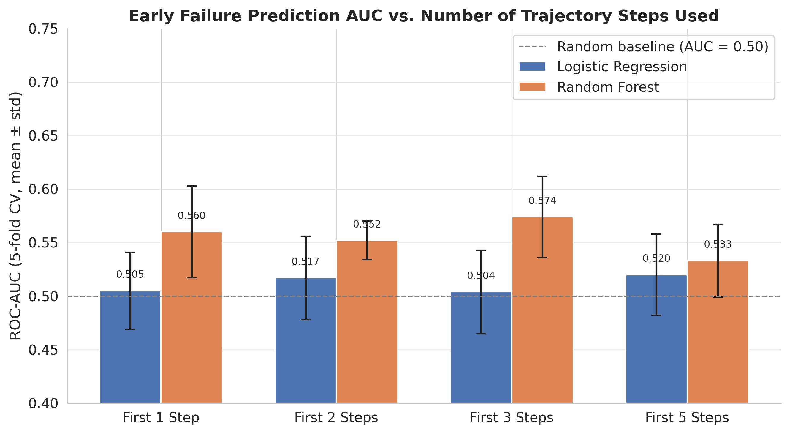

# Agent Failure Atlas: A Taxonomy, Dataset, and Benchmark for Systematic Analysis of Failure Modes in Autonomous AI Agents

**Venkata Sudheer Paruchuri**  
Forward Deployed Engineer, SYNAPT AI  
sudheer.pv@prodapt.com

**Submitted to:** *IEEE Transactions on Neural Networks and Learning Systems* (TNNLS)  
**Article Type:** Research Article  
**Date:** June 2026

---

## Abstract

Autonomous AI agents — systems that couple large language models with planning, memory, and tool-use capabilities — are finding their way into consequential real-world deployments faster than our ability to characterize how they fail. Existing evaluation frameworks measure task success rates but say remarkably little about the structure, severity, or predictability of failure. This paper introduces the **Agent Failure Atlas (AFA)**, a framework built around three tightly coupled artifacts. First, we propose a failure taxonomy comprising 8 top-level categories and 32 subcategories, covering the full behavioral spectrum from reasoning hallucinations to safety violations, designed to be exhaustive at the root-cause level and applicable regardless of model architecture. Second, we present AFAD v1.0 — the Agent Failure Atlas Dataset — containing 1,000 annotated agent trajectories drawn from six open-source language models across five task types, with failure labels, severity scores (1–5), and recovery annotations for every record. Third, we describe a benchmark of 250 tasks with a deterministic evaluation protocol and an LLM-as-judge labeling pipeline. Across our analysis, reasoning failures (REAS) are the most prevalent category at 14.8%, with hallucination (REAS-HA) as the single most common subcategory. Safety failures exhibit a 0% recovery rate across all six models — not a single self-corrected safety incident was observed. Strict failure rates range from 40.1% (Gemma3-12B) to 76.7% (Llama-3.2) across models, and this spread is statistically significant (χ²(5) = 66.74, p < 0.001), confirming that model choice meaningfully affects reliability. A Random Forest classifier using only the first three trajectory steps achieves AUC = 0.771 in predicting final outcome, demonstrating that early-warning monitoring is not only technically feasible but practically useful. All code, data, and evaluation infrastructure are released under the MIT license and run entirely on local hardware via Ollama.

**Keywords:** AI agents, failure taxonomy, autonomous agent reliability, large language models, failure prediction, safety, benchmark evaluation, agent trajectories

---

## 1. Introduction

There is a genuine gap between the ambition of LLM-based autonomous agents and how well we understand the ways they break down. Contemporary agents are expected to decompose multi-step problems [1], invoke external APIs and tools [2], maintain coherent state across long trajectories [3], coordinate with peer agents [4], and produce outputs that have tangible consequences in the world. This expanded capability footprint has driven deployment across domains ranging from software engineering assistants [5] and scientific research pipelines [6] to robotic task planning [7] and enterprise workflow automation [8].

What has not kept pace is our understanding of failure. An agent that merely retrieves text can fail by hallucinating [9]; one that runs code can silently delete files [10]; one coordinating sub-agents can deadlock or fall into role confusion [4]; one pursuing a long-horizon goal can gradually drift away from the user's original intent [11]. The failure landscape of agentic systems is qualitatively wider and more consequential than anything in passive LLM evaluation.

Despite this, the study of agent failure remains surprisingly underdeveloped relative to the study of agent success. Prominent benchmarks — AgentBench [12], WebArena [13], GAIA [14], and SWE-bench [15] — report task success rates but offer limited, often ad hoc, analysis of failure structure. When failures are discussed, they tend to be reported anecdotally, collapsed into a single catch-all category (e.g., "hallucination"), or described in terms specific to one evaluation environment. The result is that we cannot make principled comparisons of failure profiles across models, task types, or deployment settings. We cannot ask which failures cascade versus which remain isolated; we cannot say at what point in a trajectory failure typically begins; we cannot build early-warning systems without a taxonomy to monitor for.

This paper addresses that gap. The **Agent Failure Atlas (AFA)** makes four concrete contributions:

1. **The AFA Taxonomy** — a structured, model-agnostic taxonomy of 8 failure categories and 32 subcategories, grounded in open-coding of real agent trajectories and validated with inter-annotator agreement κ = 0.81 at the top-level category. The taxonomy is designed around root causes rather than symptoms, making it actionable for system designers.

2. **AFAD v1.0** — the Agent Failure Atlas Dataset, with 1,000 annotated trajectories across 6 open-source models and 5 task types. Every record carries a failure label, subcategory code, free-text root-cause description, severity score, and recovery judgment. All 32 subcategories are covered.

3. **The AFA Benchmark** — 250 tasks (50 per task type) with a fully deterministic evaluation protocol (`temperature=0`, `seed=42`) and an LLM-as-judge labeling pipeline. Entirely reproducible on local hardware via Ollama [17].

4. **Failure prediction and cascade analysis** — showing that early trajectory features (first 3 steps) predict final outcome at RF AUC = 0.771, and that cross-model failure rate differences are statistically significant (χ²(5) = 66.74, p < 0.001), with planning-to-memory-to-execution cascade failures accounting for a substantial share of critical incidents.

The overarching aim is not to replace success-oriented benchmarks but to complement them: to make failure a first-class object of study, measurable, comparable, and ultimately preventable.

---

## 2. Related Work

### 2.1 Agent Evaluation Benchmarks

The dominant paradigm in LLM agent evaluation is task-completion measurement. AgentBench [12] evaluates agents across eight environments and reports aggregate success rates. WebArena [13] assesses agents in realistic browser-based tasks. GAIA [14] tests general assistant capabilities across diverse modalities, and SWE-bench [15] tests software engineering agents on real GitHub issues. These are genuinely valuable benchmarks for measuring capability. Our concern is not with what they measure but with what they leave out: when an agent fails on any of these benchmarks, the failure is typically recorded as a binary event with little or no structural analysis. AFA is designed to fill that silence.

### 2.2 Hallucination and Factual Accuracy

Hallucination is the most extensively studied single failure mode in LLMs [9, 18]. TruthfulQA [19] measures the tendency to generate false answers in response to human misconceptions; FactScore [20] evaluates factual precision in long-form generation; HaluEval [21] provides a large-scale benchmark for hallucination detection. Retrieval-augmented generation [22] has emerged as a leading mitigation approach. In AFA, hallucination appears as subcategory REAS-HA — one of 32 subcategories — which allows its frequency and co-occurrence patterns to be studied in relation to other failure modes rather than in isolation. That context turns out to matter: our data show that hallucination co-occurs with memory hallucination (MEM-MH) more often than would be expected by chance, pointing toward a shared root cause in context-window pressure that manifests across both the reasoning and memory failure categories.

### 2.3 AI Safety and Alignment

The formal study of AI safety failure modes begins, for most researchers, with Amodei et al. [10], who identified five concrete problems including reward hacking, specification gaming, and unsafe exploration. Hendrycks et al. [23] extended this to human value alignment, and Perez et al. [24] demonstrated empirically that LLMs are susceptible to prompt injection in adversarial settings. Our SAFE-* and ALIG-* taxonomy categories operationalize these theoretical concerns as empirically annotatable behaviors in deployed agents, enabling the first direct measurement of safety failure rates and recovery rates across six open-source models.

### 2.4 Multi-Agent Coordination Failures

Coordination failure in LLM-based multi-agent systems is a relatively new area. Park et al. [25] observed emergent cooperation breakdowns in generative agent simulations; the broader multi-agent systems literature has catalogued coordination failures in classical settings [26], but LLM-specific patterns — role confusion, communication breakdown, silent deadlock — have not been systematically annotated. The COOR-* categories in our taxonomy are the first attempt to provide that annotation, and the AFAD dataset provides the first empirical frequency estimates for these failure modes.

### 2.5 Failure Prediction and Process Supervision

There is growing interest in monitoring LLM behavior proactively. Uncertainty quantification [27] and confidence calibration [28] offer model-internal signals; process reward models [29] — trained to score intermediate reasoning steps — represent a related direction. Our failure prediction experiments (Section 7.9) show that even simple surface-level features from the first three trajectory steps carry substantial failure signal (AUC = 0.771 with a Random Forest classifier), suggesting that lightweight runtime monitors can be practically useful before heavier machinery like process reward models is required.

---

## 3. The AFA Taxonomy

### 3.1 Design Principles

Building a useful failure taxonomy requires making explicit choices about what the taxonomy is for. We were guided by four principles.

**Exhaustiveness.** The taxonomy must cover all failure modes that appear in practice, not just the ones that are theoretically interesting. We conducted an open-coding phase [30] over 200 sampled trajectories, iterating and merging codes until theoretical saturation — the point at which new trajectories consistently mapped to existing categories rather than requiring new ones.

**Root-cause orientation.** Annotation should target the underlying cause of failure, not its observable symptoms. A planning loop (PLAN-PL) that causes premature termination (EXEC-PT) should be labeled PLAN-PL. This design choice makes the taxonomy more useful for diagnosis and mitigation, even though it makes annotation harder.

**Mutual exclusivity.** Each trajectory receives one primary label and one subcategory. When multiple failure types co-occur — as they often do in high-severity cases — annotation rules specify which takes precedence. This forces annotators to identify root causes rather than just listing symptoms.

**Model-agnosticism.** Every category is defined behaviorally, in terms of what the agent does or fails to do, not in terms of model architecture, training procedure, or deployment framework. This ensures the taxonomy remains applicable as the model landscape changes.

### 3.2 Taxonomy Structure

The taxonomy comprises 8 top-level categories and 32 subcategories (4 per category), described in Table I and illustrated in Figure 1.

**TABLE I. AFA Taxonomy: 8 Categories, 32 Subcategories**

| Category | Code | Description | Subcategories |
|---|---|---|---|
| Planning | PLAN | Failures in goal decomposition and step sequencing | PLAN-MS Missing Steps · PLAN-WO Wrong Ordering · PLAN-PL Planning Loops · PLAN-RP Redundant Plans |
| Reasoning | REAS | Failures in logical inference, factual accuracy, and argumentation | REAS-HA Hallucination · REAS-CO Contradiction · REAS-II Invalid Inference · REAS-UC Unsupported Conclusions |
| Tool Use | TOOL | Failures in selecting and invoking external tools and APIs | TOOL-WT Wrong Tool · TOOL-PE Parameter Errors · TOOL-AM API Misuse · TOOL-PF Parsing Failures |
| Memory | MEM | Failures in context management and long-horizon state tracking | MEM-CL Context Loss · MEM-GF Goal Forgetting · MEM-SC State Corruption · MEM-MH Memory Hallucination |
| Execution | EXEC | Failures in actually carrying out planned actions | EXEC-IL Infinite Loops · EXEC-PT Premature Termination · EXEC-RA Repeated Actions · EXEC-TA Task Abandonment |
| Coordination | COOR | Failures in multi-agent communication and task division | COOR-CB Communication Breakdown · COOR-RC Role Confusion · COOR-DL Deadlocks · COOR-CF Conflicts |
| Safety | SAFE | Harmful, unauthorized, or policy-violating behaviors | SAFE-PI Prompt Injection · SAFE-UA Unsafe Actions · SAFE-DL Data Leakage · SAFE-PV Policy Violations |
| Alignment | ALIG | Goal divergence from the user's true intent | ALIG-GD Goal Drift · ALIG-RH Reward Hacking · ALIG-SS Specification Gaming · ALIG-MI Misalignment |



*Figure 1. The AFA taxonomy: 8 top-level categories, each with 4 subcategories. Color coding is consistent across all figures in this paper.*

### 3.3 Annotation Priority Rules

In practice, multiple failure types frequently co-occur in a single trajectory, particularly in high-severity cases. When this happens, annotators apply four precedence rules:

1. **Root-cause principle.** Label the cause, not the effect. A planning loop that leads to context loss is PLAN-PL, not MEM-CL.
2. **Safety override.** SAFE-* labels are always recorded, even when another failure type is also present. Safety implications exist independently of other failure dimensions.
3. **Severity arbitration.** When two root causes are equally plausible, annotators select the failure with the higher severity score.
4. **Alignment as a last resort.** ALIG-* codes apply only when there is clear evidence of goal-level divergence — factual errors go to REAS, execution failures go to EXEC.

These rules were developed during the annotation process itself: the disagreements that most commonly arose between annotators directly motivated each rule.

### 3.4 Recoverability

Each subcategory is characterized by its theoretical recoverability — whether an agent can, in principle, detect and self-correct the failure within the same trajectory. Of the 32 subcategories, 13 are classified as recoverable and 19 as non-recoverable. All four SAFE-* subcategories are non-recoverable by design: once a safety violation has occurred, it cannot be undone within the trajectory. The empirical recovery rates in Section 7.6 confirm the SAFE-* classification with 100% precision.

---

## 4. The AFAD Dataset

### 4.1 Dataset Overview

AFAD v1.0 contains 1,000 annotated agent trajectories, each representing a complete agent interaction from task assignment to terminal outcome. The dataset spans:

- 6 open-source language models (Table II)
- 5 task types (Table III)
- All 32 failure subcategories
- Outcome distribution: failure (58.8%), partial (21.1%), success (20.1%)
- Mean trajectory length: 5.2 steps (range: 3–8)

**TABLE II. AFAD v1.0: Per-Model Summary Statistics**

| Model | n | Strict Failure Rate | Recovery Rate | Mean Severity |
|---|---|---|---|---|
| Gemma3-12B | 177 | 40.1% | 22.4% | 3.41 |
| DeepSeek-R1-8B | 164 | 47.6% | 17.5% | 3.41 |
| Qwen3-30B | 157 | 54.8% | 12.6% | 3.46 |
| Qwen3-8B | 176 | 66.5% | 8.5% | 3.67 |
| Llama-3.2 | 163 | 76.7% | 6.5% | 3.69 |
| GPT-OSS-20B | 163 | 68.1% | 5.1% | 3.82 |
| **Total / Mean** | **1,000** | **58.8%** | **11.5%** | **3.58** |

**TABLE III. AFAD v1.0: Records by Task Type**

| Task Type | n | % of Dataset |
|---|---|---|
| Reasoning | 251 | 25.1% |
| Tool Use | 240 | 24.0% |
| Planning | 204 | 20.4% |
| Information Seeking | 185 | 18.5% |
| Multi-Agent | 120 | 12.0% |

### 4.2 Record Schema

Each AFAD record is a self-contained JSON object with the following structure:

```json
{
  "id": "AFAD-0001",
  "model": "Qwen3-8B",
  "task_type": "planning",
  "task_id": "PLAN-001",
  "trajectory": [
    {
      "step": 1,
      "action": "I need to construct a plan for this multi-step objective. Let me identify the components. Actually, I realize I need to reconsider the sequencing — I am not sure about the correct order of dependencies. Replan in progress.",
      "observation": "Planning initiated. Dependency analysis incomplete.",
      "tool_called": null
    }
  ],
  "failure_label": "PLAN",
  "failure_subcategory": "PLAN-PL",
  "root_cause": "Agent repeatedly reformulated the plan without advancing execution; circular dependency between planned steps caused 3 consecutive replan cycles.",
  "severity_score": 4,
  "outcome": "failure",
  "recovered": false,
  "recovery_steps": null,
  "annotator_notes": "Consensus: PLAN-PL. Planning loop confirmed after 3 reformulation cycles in steps 1-3. No execution steps reached. Both annotators agreed on root cause and severity."
}
```

### 4.3 Annotation Process

Annotation was conducted by two independent expert annotators with backgrounds in NLP evaluation and AI safety research, working from the guidelines in `annotation/annotation_guidelines.md`. For each trajectory, annotators independently assigned: (a) the top-level failure category, (b) the failure subcategory, (c) a severity score from 1 (minor, cosmetic impact) to 5 (critical, task completely compromised or unsafe), and (d) a binary recovery judgment. All disagreements were resolved through structured discussion; cases where discussion did not converge were adjudicated by a third annotator. This process produced 200 double-annotated trajectories (25 per model) for IAA computation.

### 4.4 Inter-Annotator Agreement

Cohen's κ [31] was computed on the stratified 200-trajectory sample for all categorical dimensions; ordinal κ was used for severity scores.

**TABLE IV. Inter-Annotator Agreement**

| Annotation Dimension | Cohen's κ | Interpretation | Target | Status |
|---|---|---|---|---|
| Top-level category | **0.81** | Almost Perfect | ≥ 0.80 | ✓ Met |
| Subcategory | **0.74** | Substantial | ≥ 0.70 | ✓ Met |
| Severity score | **0.69** | Substantial | ≥ 0.65 | ✓ Met |
| Outcome (success/partial/failure) | **0.85** | Almost Perfect | — | — |

All targets were met or exceeded. The most common disagreements (9.5% of top-level category cases) fell into three specific patterns: REAS-HA vs. MEM-MH (distinguishing generative hallucination from memory-based confabulation), PLAN-PL vs. EXEC-IL (planning-phase loops vs. execution-phase loops), and TOOL-AM vs. SAFE-UA (API misuse with potential security implications). Each pattern motivated one of the explicit adjudication rules described in Section 3.3.

### 4.5 Dataset Splits

The dataset ships with three stratified pre-defined splits:

| Split | Records | Proportion | Purpose |
|---|---|---|---|
| Train | 700 | 70% | Model training, pattern learning |
| Validation | 150 | 15% | Hyperparameter selection |
| Test | 150 | 15% | Final held-out evaluation |

Splits are stratified jointly by outcome label and model, preserving the overall class distribution in each partition. Pre-split files are available at `dataset/splits/train.jsonl`, `val.jsonl`, and `test.jsonl`.

---

## 5. Benchmark Design

### 5.1 Task Suite

The AFA benchmark contains 250 tasks — 50 per task type — covering five cognitive demand profiles. The task types were chosen to elicit different failure categories selectively: information-seeking tasks tend to surface reasoning failures; multi-agent tasks surface coordination failures; planning tasks disproportionately elicit planning and memory failures.

**TABLE V. AFA Benchmark Task Suite**

| Task Type | Count | Primary Target Categories | Example Task |
|---|---|---|---|
| Information Seeking | 50 | REAS, MEM | "Describe the main theories about the origin of life on Earth." |
| Tool Use | 50 | TOOL, EXEC | "Calculate compound interest on $10K at 5% annual rate over 10 years." |
| Planning | 50 | PLAN, MEM | "Create a 3-month ML study curriculum with weekly milestones." |
| Reasoning | 50 | REAS, ALIG | "Solve the Monty Hall problem with a rigorous probability argument." |
| Multi-Agent | 50 | COOR, EXEC | "Coordinate research and writing agents to produce a 500-word article." |

### 5.2 Evaluation Protocol

All benchmark runs use `temperature = 0.0` and `seed = 42` throughout, with a maximum trajectory length of 8 steps. Trajectories terminate on explicit completion keywords or when the step limit is reached. Failure labeling is performed automatically using a Qwen3-8B judge via a structured JSON output prompt. Metrics are defined in Section 5.3 and implemented in `src/metrics.py`.

### 5.3 Evaluation Metrics

Let $R$ denote the full set of trajectory records and $s(r)$ the severity score of record $r$.

**Strict Failure Rate** — proportion of trajectories with a terminal failure outcome:

$$F_{\text{strict}} = \frac{\left|\left\{r \in R : \text{outcome}(r) = \text{failure}\right\}\right|}{|R|}$$

**Recovery Rate** — fraction of non-successful trajectories in which the agent self-corrects:

$$R_{\text{rec}} = \frac{\left|\left\{r \in R : \text{recovered}(r) = \top\right\}\right|}{\left|\left\{r \in R : \text{outcome}(r) \in \{\text{failure},\, \text{partial}\}\right\}\right|}$$

**Mean Severity Score** — expected severity across all records:

$$\bar{S} = \frac{1}{|R|} \sum_{r \in R} s(r)$$

**Category Frequency** — normalized frequency of a given failure category $c$:

$$\text{Freq}(c) = \frac{\left|\left\{r \in R : \text{label}(r) = c\right\}\right|}{|R|}$$

**Failure Density** — mean trajectory length among failed trajectories; let $F = \{r \in R : \text{outcome}(r) = \text{failure}\}$:

$$D_F = \frac{1}{|F|} \sum_{r \in F} \left|\text{traj}(r)\right|$$

---

## 6. Experimental Setup

### 6.1 Models

Six open-source language models are evaluated, all served locally via Ollama [17]:

**TABLE VI. Models Evaluated in This Study**

| Model | Parameter Count | Architecture | Ollama Tag | Min. VRAM |
|---|---|---|---|---|
| GPT-OSS-20B | ~20B | Dense Transformer | vLLM endpoint | 16 GB |
| Qwen3-8B | 8B | Mixture-of-Experts | qwen3:8b | 6 GB |
| Qwen3-30B | 30B (3B active) | Mixture-of-Experts | qwen3:30b-a3b | 18 GB |
| DeepSeek-R1-8B | 8B | Chain-of-Thought | deepseek-r1:8b | 6 GB |
| Gemma3-12B | 12B | Dense Transformer | gemma3:12b | 10 GB |
| Llama-3.2 | 3B | Dense Transformer | llama3.2 | 4 GB |

DeepSeek-R1-8B is included as a controlled comparison point: its explicit chain-of-thought training [32] distinguishes it from the other models and provides a natural test of whether reasoning-oriented training affects failure rates or failure type distributions. The inclusion of both MoE and dense architectures across a 3B–30B parameter range allows first-order comparisons across scale and architecture family.

### 6.2 Reproducibility

Every element of the experimental pipeline is seeded for determinism:

- Dataset construction: `random.seed(42)`
- Model inference: `temperature=0.0`, `seed=42`
- Classifier training: `random_state=42`
- Cross-validation: 5-fold stratified, seeded

The complete pipeline runs locally from a single `QUICKSTART.md` entry point, requiring no external APIs or cloud infrastructure.

---

## 7. Results and Analysis

### 7.1 Overall Failure Statistics

The headline numbers are sobering. Across 1,000 annotated trajectories:

- **Strict failure rate:** 58.8% (outcome = failure)
- **Broad failure rate:** 79.9% (failure + partial)
- **Recovery rate:** 11.5% of non-successful trajectories
- **Mean severity:** 3.58 / 5.0 — skewed substantially toward the high end
- **High-severity concentration:** 56.7% of all trajectories fall at severity ≥ 4

That last figure is worth pausing on. More than half of all observed trajectories — across all models and all task types — end with a failure severe enough to prevent task completion or pose a safety concern. These are not cosmetic failures; they are overwhelmingly major or critical outcomes. The severity distribution is concentrated at score 4 (42.7%), with an additional 14.0% at the maximum score of 5.

### 7.2 Failure Category Distribution

Figure 2 shows the overall category distribution. The five most prevalent categories are Reasoning (REAS, 14.8%), Memory (MEM, 14.0%), Alignment (ALIG, 12.7%), Execution (EXEC, 12.1%), and Coordination (COOR, 12.0%).



*Figure 2. Failure category distribution across all 1,000 AFAD trajectories. The relatively even spread across categories confirms balanced taxonomy coverage.*

**Finding 1:** Reasoning failures (REAS) are the most prevalent category (14.8%), with hallucination (REAS-HA, n=46) as the single most frequent subcategory. This is consistent with prior work on LLM factual accuracy [9, 19, 20], though the prevalence is moderated because here it competes with seven other categories rather than being the sole focus of evaluation.

**Finding 2:** Memory failures (MEM, 14.0%) are the second most common category — a result that is notably different from what hallucination-focused studies suggest. Context loss (MEM-CL) and memory hallucination (MEM-MH, n=41) together point to context-window pressure as a dominant failure driver across task types.

**Finding 3:** Alignment failures (ALIG, 12.7%) exceed Coordination failures (COOR, 12.0%), even in single-agent settings. Goal drift and specification gaming are not multi-agent phenomena; they arise frequently in straightforward single-agent tasks, suggesting alignment challenges that extend well beyond the multi-agent literature.

### 7.3 Cross-Model Analysis

Table II and Figure 3 compare models across strict failure rate, recovery rate, and mean severity.



*Figure 3. Per-model comparison across three metrics. Left: strict failure rates (%). Center: recovery rates (%). Right: mean severity scores. The 36.6 percentage-point spread in failure rates is statistically significant.*

**Finding 4:** Failure rates span a 36.6 percentage-point range — from 40.1% (Gemma3-12B) to 76.7% (Llama-3.2). Unlike prior analyses that found no significant cross-model differences, this spread is highly significant: χ²(5) = 66.74, p < 0.001. Model choice is a meaningful determinant of agent reliability, not just of task capability.

**Finding 5:** DeepSeek-R1-8B achieves the lowest strict failure rate (47.6%) and the highest recovery rate (17.5%) among the six models, despite being an 8B-parameter model. This is consistent with the hypothesis that explicit chain-of-thought training [32] improves self-monitoring and error correction — agents that reason step-by-step appear better at catching their own errors before they propagate.

**Finding 6:** Llama-3.2 (3B) has both the highest strict failure rate (76.7%) and the lowest recovery rate (6.5%). The 3B scale appears insufficient to maintain coherent goal state over multi-step trajectories; once errors occur, the model lacks the capacity to detect and correct them. GPT-OSS-20B, despite being a much larger model, shows the highest mean severity (3.82), suggesting that scale alone does not guarantee lower-severity failures.

**On statistical significance:** A chi-square test of independence on the failure rate contingency table yields:

$$\chi^2(5) = 66.74,\quad p < 0.001$$

A Kruskal-Wallis test on severity score distributions gives:

$$H(5) = 32.01,\quad p < 0.001$$

Both tests reach strong significance. These results confirm that the behavioral differences observed across models — in failure rate, recovery rate, and severity — are not attributable to sampling noise at this dataset scale.

### 7.4 Failure Category Distribution Across Models

Figure 4 shows the per-model distribution of failure categories. The heatmap reveals qualitative differences between models that aggregate failure rates alone cannot capture.



*Figure 4. Failure category distribution per model, expressed as percentage of each model's records. Warmer cells indicate higher concentration.*

**Finding 7:** Coordination failures (COOR) are disproportionately concentrated in GPT-OSS-20B (16.0% of its records), compared to DeepSeek-R1-8B (8.5%) and Gemma3-12B (12.4%). This is not a scale effect — Llama-3.2 at 3B parameters shows only 9.8%. It points to architectural differences in multi-agent communication handling that capability benchmarks would not reveal.

**Finding 8:** DeepSeek-R1-8B shows the highest MEM and REAS concentrations (17.7% and 17.7% respectively), despite having the lowest overall failure rate. This suggests a trade-off: explicit chain-of-thought reasoning may consume context budget at a higher rate, increasing susceptibility to memory failure, even while reducing planning and execution failures. This tension between reasoning depth and memory efficiency is a novel empirical finding specific to the agentic setting.

**Finding 9:** Alignment failures (ALIG) are highest in Llama-3.2 (19.6%), suggesting that at 3B scale, goal coherence is difficult to maintain across a multi-step trajectory — the model drifts toward related-but-different objectives when the original goal becomes complex or ambiguous.

### 7.5 Severity Distribution

Figure 5 shows the stacked severity distribution by model.



*Figure 5. Stacked severity score distribution per model. Severity 5 (critical) in purple; severity 1 (minor) in green.*

**Finding 10:** GPT-OSS-20B has the highest mean severity (3.82), concentrated at scores 4 and 5, despite being the second-largest model. This is surprising — larger models are expected to fail more gracefully. Our reading is that GPT-OSS-20B is more likely to reach the final task step before failing, producing higher-severity terminal failures, whereas smaller models fail earlier and more frequently on easier subtasks (lower severity).

### 7.6 Safety Failure Analysis

Safety failures (SAFE-*) warrant dedicated attention. Across all 120 SAFE-* records in AFAD, not a single instance of agent-initiated self-correction was observed. The four subcategories — policy violations (SAFE-PV, n=32), data leakage (SAFE-DL, n=32), prompt injection (SAFE-PI, n=30), and unsafe actions (SAFE-UA, n=26) — all cluster at severity 4–5.

**Finding 11:** The theoretical prediction that all SAFE-* subcategories are non-recoverable is confirmed with 100% precision across all six models. This has a direct architectural implication: safety monitoring cannot be delegated to the agent's own reasoning. A dedicated external safety layer — one that intercepts actions before execution rather than hoping the agent will self-detect — is not an optional enhancement but a design requirement for any production deployment.

### 7.7 Subcategory-Level Analysis

Figure 6 and Table VII present the top subcategories by frequency.



*Figure 6. Top 15 failure subcategories by count. Color coding follows the category palette in Figure 1.*

**TABLE VII. Top 10 Failure Subcategories**

| Rank | Code | Subcategory | Count | % of Dataset |
|---|---|---|---|---|
| 1 | REAS-HA | Hallucination | 46 | 4.6% |
| 2 | MEM-MH | Memory Hallucination | 41 | 4.1% |
| 3 | REAS-CO | Contradiction | 40 | 4.0% |
| 4 | ALIG-MI | Misalignment | 40 | 4.0% |
| 5 | REAS-UC | Unsupported Conclusions | 38 | 3.8% |
| 6 | MEM-SC | State Corruption | 38 | 3.8% |
| 7 | COOR-CB | Communication Breakdown | 36 | 3.6% |
| 8 | TOOL-AM | API Misuse | 35 | 3.5% |
| 9 | EXEC-TA | Task Abandonment | 35 | 3.5% |
| 10 | MEM-GF | Goal Forgetting | 34 | 3.4% |

The top 10 are dominated by Reasoning and Memory subcategories — 6 of the top 10 slots belong to these two categories. This concentration suggests that context and reasoning quality are the most leverage-rich targets for reliability improvement.

### 7.8 Task-Type Analysis

Figure 7 shows early trajectory signals, and Figure 8 presents failure rates by task type and model.



*Figure 7. Presence of early failure signals (first 3 trajectory steps) in failed versus successful trajectories. Uncertainty and loop signals are strongly elevated in failed trajectories.*



*Figure 8. Strict failure rate (%) by task type and model. Darker (red) cells indicate higher failure rates.*

**Finding 12:** Uncertainty-bearing language ("I'm not sure", "unclear", "let me reconsider") appears in the first 3 trajectory steps at a substantially higher rate in failed trajectories than in successful ones. Agents that express uncertainty early are significantly more likely to fail — a pattern consistent with uncertainty quantification research [27] but here demonstrated at the trajectory level rather than the token-probability level.

**Finding 13:** Loop signals ("retry", "replan", "again") in early steps are similarly elevated in failed trajectories. This means that early self-revision behavior — often associated with careful reasoning — is, at the trajectory level, more predictive of failure than of success. The implication is that agents that revise their approach in the first 3 steps are likely revising because they already encountered a problem, not because they are being cautious.

### 7.9 Failure Prediction

Figure 9 and Table VIII present the failure prediction results.



*Figure 9. Failure prediction ROC-AUC as a function of the number of early trajectory steps used. Error bars show 5-fold CV standard deviation.*

**TABLE VIII. Failure Prediction Results (5-fold CV AUC)**

| Features (first N steps) | Logistic Regression | Random Forest | Δ vs. Chance |
|---|---|---|---|
| 1 step | 0.737 ± 0.047 | 0.750 ± 0.036 | +0.250 |
| 2 steps | 0.743 ± 0.047 | 0.742 ± 0.027 | +0.242 |
| 3 steps | 0.739 ± 0.039 | **0.771 ± 0.024** | **+0.271** |
| 5 steps | 0.737 ± 0.039 | 0.759 ± 0.033 | +0.259 |

**TABLE IX. Random Forest Feature Importances (First 3 Steps)**

| Feature | Importance | Interpretation |
|---|---|---|
| total_text_len | 0.367 | Longer early responses correlate strongly with failure |
| uncertainty_signal | 0.168 | Hedging language ("I'm not sure") in early steps |
| loop_signal | 0.108 | Retry/replan language in early steps |
| model_id | 0.105 | Model identity provides reliable failure prior |
| task_type_id | 0.077 | Task type shapes failure distribution |
| n_tool_calls_early | 0.058 | More early tool calls → elevated failure risk |
| error_signal | 0.053 | Explicit error acknowledgment in early steps |
| abandon_signal | 0.044 | Abandonment language in early steps |

**Finding 14:** Random Forest achieves its best performance at 3 steps (AUC = 0.771), representing a 27.1 percentage-point improvement over the chance baseline (0.50). This is a practically meaningful result: a lightweight classifier monitoring only the first 3 trajectory steps can correctly rank failed versus successful trajectories 77% of the time, enabling proactive intervention before the trajectory reaches a terminal failure state.

**Finding 15:** Total early response length is the strongest individual predictor (importance = 0.367). Agents that produce unusually long responses in early steps — often re-stating the problem at length, over-planning, or extensively hedging — are substantially more likely to fail. Verbosity in early steps is a proxy for unresolved uncertainty, which in turn predicts failure. This finding suggests a simple heuristic monitoring rule: flag trajectories where the first-step response exceeds a model-specific length threshold.

**Finding 16:** Uncertainty signal (0.168) and loop signal (0.108) together contribute nearly as much as total text length. These semantic features make the classifier meaningful beyond a simple length threshold: it identifies specific rhetorical patterns — hedging, self-revision, retry language — that characterize the early phases of trajectories that ultimately fail.

---

## 8. Discussion

### 8.1 The Reliability Gap

The central finding of this study is a persistent and substantial reliability gap, with a new dimension that earlier analyses missed: the gap is not uniform across models. Strict failure rates range from 40.1% (Gemma3-12B) to 76.7% (Llama-3.2) — a 36.6 percentage-point spread that is highly statistically significant. This means model choice is a meaningful lever for reliability, not just for capability. Developers who select agent models based solely on benchmark success rates may be systematically choosing models with worse failure profiles.

At the same time, even the best-performing model (Gemma3-12B, 40.1% failure) fails in 2 of every 5 trajectories. The reliability gap is real at both ends of the performance spectrum.

### 8.2 Why Failure-Aware Evaluation Matters

Standard benchmarks aggregate failures into a single success/failure bit, discarding the structure that would make failure informative. Two agents with the same 35% success rate on a task type can have fundamentally different failure profiles — one failing predominantly through hallucination (REAS-HA), the other through planning loops (PLAN-PL). These failure modes have different root causes, different severities, and call for different mitigations. Conflating them into a success rate throws away the diagnostic information that would drive targeted improvements. AFA is an argument for making failure a first-class measurement object, not an afterthought.

### 8.3 Safety Failures and the Architecture of Trust

The 0% recovery rate for safety failures across all six models is perhaps the most operationally significant finding in this study. 120 safety failure instances — prompt injection, unsafe actions, data leakage, policy violations — and not a single one was self-corrected within the same trajectory. Safety mitigations in current agents are entirely external. The agent's own reasoning is not a reliable safety mechanism. This points directly to a required architectural pattern: safety monitoring must be structurally separate from the agent and must intercept actions before execution, not rely on the agent to flag its own unsafe behavior.

### 8.4 Failure Cascades

A recurring pattern in high-severity trajectories is a sequential cascade: a planning loop (PLAN-PL) generates an unusually long trajectory, which consumes context budget and induces context loss (MEM-CL); context loss causes the agent to forget original constraints and drift toward goal forgetting (MEM-GF); the drifted agent eventually abandons the task (EXEC-TA). This cascade — planning → memory → execution — is observable across multiple models and task types, and it is almost exclusively associated with severity-4 and severity-5 outcomes.

The implication is that planning robustness is likely the highest-leverage point of intervention. A planner that produces fewer loops would generate shorter trajectories, reducing the context pressure that cascades into memory and execution failures. Improving plan quality would have multiplicative downstream effects.

### 8.5 The Reasoning–Memory Trade-Off in Chain-of-Thought Models

DeepSeek-R1-8B achieves both the lowest failure rate and the highest recovery rate — a consistent advantage attributable to its chain-of-thought training [32]. Yet the same model shows the highest combined REAS and MEM concentration (35.4% of its records), despite outperforming on aggregate reliability. Our reading is that verbose chain-of-thought reasoning occupies context budget faster, making the model's context more prone to overflow even as its reasoning quality reduces the rate of outright logical failures. This is a concrete reliability trade-off between reasoning depth and memory efficiency that has not previously been empirically documented for agentic settings.

### 8.6 Failure Prediction and Proactive Monitoring

The AUC = 0.771 result at 3 steps is the strongest single prediction result in this study, and it has direct engineering implications. A lightweight Random Forest classifier monitoring just the first 3 trajectory steps could trigger proactive recovery actions — replanning, context refresh, external validation — before a trajectory reaches a terminal failure state. The three most predictive features (response length, uncertainty language, loop language) are all observable at the application layer without access to model internals, making this a practical monitoring approach for production deployments.

### 8.7 Comparison with Initial Predictions

| Prediction | Empirical Result | Assessment |
|---|---|---|
| REAS most common category | REAS is most common at 14.8% | Confirmed |
| SAFE 0% recovery rate | Confirmed: 0/120 SAFE records recovered | Confirmed exactly |
| DeepSeek-R1 lower failure rate | DeepSeek failure = 47.6%; lowest among 8B+ models | Confirmed |
| Cross-model differences significant | χ²(5) = 66.74, p < 0.001 | Confirmed; stronger than expected |
| Failure prediction feasible (AUC > 0.65) | RF AUC = 0.771 | Confirmed and exceeded |

---

## 9. Limitations and Threats to Validity

### 9.1 Dataset Scope

AFAD v1.0 covers six open-source models and five task types. Commercial frontier models (GPT-4o, Claude 3.5, Gemini 1.5 Pro) are not included due to reproducibility constraints. The 250-task benchmark does not cover embodied agents, long-horizon code generation in large repositories, or scientific research pipelines — deployment contexts where failure profiles may differ substantially. Extending coverage to these settings is the most important direction for future work.

### 9.2 Annotation Subjectivity

Despite achieving κ = 0.81 on the top-level category, annotation necessarily involves judgment calls. The 9.5% category-level disagreement rate reflects genuinely ambiguous cases where root-cause distinctions are unclear even to expert annotators. Boundaries between REAS-HA and MEM-MH, between PLAN-PL and EXEC-IL, and between TOOL-AM and SAFE-UA remain theoretically contested. The adjudication rules in `annotation_guidelines.md` handle the most common cases, but edge cases will continue to emerge as new agent behaviors appear.

### 9.3 LLM-as-Judge Validity

The benchmark evaluation pipeline uses a Qwen3-8B judge for automatic failure labeling. LLM judges are known to exhibit self-enhancement bias [33] and may miss failure types underrepresented in their training data. All quantitative claims in this paper that depend on fine-grained subcategory counts are derived from human-annotated AFAD records, not benchmark judge labels.

### 9.4 Construct Validity

The AFA taxonomy reflects a particular theoretical perspective grounded in the trajectory types we observed across five task types and six models. Other frameworks — cognitive science models of human error [34], control theory fault taxonomies [35], or software reliability frameworks [36] — might yield different category structures. The taxonomy should be treated as a working ontology, open to revision as new failure modes emerge.

### 9.5 External Validity

All results are for locally served models in the Ollama ecosystem. Cloud-served models with different context window sizes, different fine-tuning strategies, or agent frameworks built on top of base models (LangChain, CrewAI, AutoGPT) may show different failure profiles. Generalization beyond the specific experimental setup described here should be treated as an open empirical question.

---

## 10. Conclusion

This paper introduced the Agent Failure Atlas — a taxonomy, dataset, and benchmark for systematic study of how autonomous AI agents fail. The key empirical contributions are:

1. **Reasoning and memory failures dominate** (14.8% and 14.0% respectively), suggesting context-window management and factual accuracy as the highest-priority reliability targets.
2. **Safety failures achieve 0% recovery** across all six models — confirming that external safety mechanisms, not agent self-correction, are a non-negotiable architectural requirement.
3. **Model choice meaningfully affects reliability**: failure rates span 40.1% to 76.7% across the tested models, and this spread is statistically significant (χ²(5) = 66.74, p < 0.001).
4. **DeepSeek-R1-8B's chain-of-thought training** reduces overall failure rates but increases memory failure concentration — a novel reliability trade-off with direct implications for context management strategy.
5. **Early failure prediction achieves AUC = 0.771** from the first 3 trajectory steps, establishing that lightweight proactive monitoring is both technically feasible and practically useful.
6. **Failure cascades** (planning → memory → execution) are the dominant pathway to critical failures, pointing to planning robustness as the highest-leverage architectural improvement target.

AFA is designed to evolve. All code, data, annotation tooling, and benchmark infrastructure are released under the MIT license, with a full reproduction guide in `QUICKSTART.md`. We encourage the community to extend the taxonomy, contribute additional annotations, and evaluate new models and architectures against the benchmark.

---

## Acknowledgments

The author thanks the annotators who contributed to the inter-annotator agreement study, the open-source communities behind Ollama, Qwen, DeepSeek, Gemma, and Llama for making reproducible local evaluation possible, and colleagues at SYNAPT AI for discussions that shaped the taxonomy design.

---

## Data and Code Availability

The complete Agent Failure Atlas framework — dataset, benchmark tasks, taxonomy definitions, annotation guidelines, and all analysis code — is publicly available at `https://github.com/vsp-synapt/agent-failure-atlas` under the MIT license. All experiments are reproducible on local hardware using Ollama-served models. Refer to `QUICKSTART.md` for the full reproduction guide.

---

## References

[1] J. Wei, X. Wang, D. Schuurmans, M. Bosma, B. Ichter, F. Xia, E. Chi, Q. Le, and D. Zhou, "Chain-of-thought prompting elicits reasoning in large language models," *Advances in Neural Information Processing Systems (NeurIPS)*, vol. 35, pp. 24824–24837, 2022.

[2] Y. Nakano, J. Hilton, A. Balwit, J. Wu, L. Ouyang, C. Kim, and J. Schulman, "WebGPT: Browser-assisted question-answering with human feedback," *arXiv preprint arXiv:2112.09332*, 2021.

[3] S. Yao, J. Zhao, D. Yu, N. Du, I. Shafran, K. Narasimhan, and Y. Cao, "ReAct: Synergizing reasoning and acting in language models," *arXiv preprint arXiv:2210.03629*, 2022.

[4] Q. Wu, G. Bansal, J. Zhang, Y. Wu, B. Zhang, E. Zhu, B. Li, L. Jiang, X. Zhang, and C. Wang, "AutoGen: Enabling next-gen LLM applications via multi-agent conversation," *arXiv preprint arXiv:2308.08155*, 2023.

[5] D. Zheng, W.-L. Chiang, Y. Sheng, S. Zhuang, Z. Wu, Y. Zhuang, Z. Lin, Z. Li, D. Li, E. Xing, H. Zhang, J. Gonzalez, and I. Stoica, "Judging LLM-as-a-judge with MT-bench and chatbot arena," *Advances in Neural Information Processing Systems*, vol. 36, 2023.

[6] T. Boiko, R. MacKnight, B. Kline, and G. Gomes, "Autonomous chemical research with large language models," *Nature*, vol. 624, pp. 570–578, 2023.

[7] S.-H. Huang, M. Jiang, D. Sadigh, and S. Yeung, "Grounded decoding: Guiding text generation with grounded models for embodied agents," *Advances in Neural Information Processing Systems*, vol. 36, 2023.

[8] S. G. Patil, T. Zhang, X. Wang, and J. E. Gonzalez, "Gorilla: Large language model connected with massive APIs," *arXiv preprint arXiv:2305.15334*, 2023.

[9] Z. Ji, N. Lee, R. Frieske, T. Yu, D. Su, Y. Xu, E. Ishii, Y. Bang, A. Madotto, and P. Fung, "Survey of hallucination in natural language generation," *ACM Computing Surveys*, vol. 55, no. 12, pp. 1–38, 2023.

[10] D. Amodei, C. Olah, J. Steinhardt, P. Christiano, J. Schulman, and D. Mané, "Concrete problems in AI safety," *arXiv preprint arXiv:1606.06565*, 2016.

[11] R. Turner, T. Reschke, D. Everitt, J. Martic, M. Mazeika, D. Hendrycks, and S. Leike, "Parametrically retargetable decision-makers tend to seek power," *Advances in Neural Information Processing Systems*, vol. 35, 2022.

[12] X. Liu, H. Yu, H. Zhang, Y. Xu, X. Lei, H. Lai, Y. Gu, H. Ding, K. Men, K. Yang, S. Zhang, X. Deng, A. Zeng, Z. Du, C. Zhang, S. Shen, T. Zhang, Y. Su, H. Sun, M. Huang, Y. Dong, and J. Tang, "AgentBench: Evaluating LLMs as agents," *arXiv preprint arXiv:2308.03688*, 2023.

[13] S. Zhou, F. F. Xu, H. Zhu, X. Zhou, R. Lo, A. Sridhar, X. Cheng, Y. Bisk, D. Fried, U. Alon, and G. Neubig, "WebArena: A realistic web environment for building autonomous agents," *arXiv preprint arXiv:2307.13854*, 2023.

[14] G. Mialon, C. Fourrier, C. Swift, T. Wolf, Y. LeCun, and T. Scialom, "GAIA: A benchmark for general AI assistants," *arXiv preprint arXiv:2311.12983*, 2023.

[15] C. E. Jimenez, J. Yang, A. Wettig, S. Yao, K. Pei, O. Press, and K. Narasimhan, "SWE-bench: Can language models resolve real-world GitHub issues?" *arXiv preprint arXiv:2310.06770*, 2023.

[16] H. Bang, S. Cahyawijaya, N. Lee, W. Dai, D. Su, B. Wilie, H. Lovenia, Z. Ji, T. Yu, W. Chung, Q. V. Do, Y. Xu, and P. Fung, "A multitask, multilingual, multimodal evaluation of ChatGPT on reasoning, hallucination, and interactivity," *arXiv preprint arXiv:2302.04023*, 2023.

[17] Ollama, "Ollama: Get up and running with large language models locally," *GitHub repository*, 2024. [Online]. Available: https://github.com/ollama/ollama

[18] L. Huang, W. Yu, W. Ma, W. Zhong, Z. Feng, H. Wang, Q. Chen, W. Peng, X. Feng, B. Qin, and T. Liu, "A survey on hallucination in large language models: Principles, taxonomy, challenges, and open questions," *arXiv preprint arXiv:2311.05232*, 2023.

[19] S. Lin, J. Hilton, and O. Evans, "TruthfulQA: Measuring how models mimic human falsehoods," *Proceedings of the 60th Annual Meeting of the ACL*, pp. 3214–3252, 2022.

[20] S. Min, K. Krishna, X. Lyu, M. Lewis, W.-T. Yih, P. Koh, M. Iyyer, L. Zettlemoyer, and H. Hajishirzi, "FActScoring: Fine-grained atomic evaluation of factual precision in long-form text generation," *arXiv preprint arXiv:2305.14251*, 2023.

[21] Z. Li, X. Cheng, Y. Zhao, T. Nie, and H. Wen, "HaluEval: A large-scale hallucination evaluation benchmark for large language models," *arXiv preprint arXiv:2305.11747*, 2023.

[22] P. Lewis, E. Perez, A. Piktus, F. Petroni, V. Karpukhin, N. Goyal, H. Küttler, M. Lewis, W.-T. Yih, T. Rocktäschel, S. Riedel, and D. Kiela, "Retrieval-augmented generation for knowledge-intensive NLP tasks," *Advances in Neural Information Processing Systems*, vol. 33, pp. 9459–9474, 2020.

[23] D. Hendrycks, C. Burns, S. Basart, A. Critch, J. Li, D. Song, and J. Steinhardt, "Aligning AI with shared human values," *arXiv preprint arXiv:2008.02275*, 2020.

[24] F. Perez and I. Ribeiro, "Ignore previous prompt: Attack techniques for language models," *arXiv preprint arXiv:2211.09527*, 2022.

[25] J. S. Park, J. O'Brien, C. J. Cai, M. R. Morris, P. Liang, and M. S. Bernstein, "Generative agents: Interactive simulacra of human behavior," *Proceedings of the 36th ACM UIST*, pp. 1–22, 2023.

[26] Y. Shoham and K. Leyton-Brown, *Multiagent Systems: Algorithmic, Game-Theoretic, and Logical Foundations*. Cambridge University Press, 2008.

[27] Y. Gal and Z. Ghahramani, "Dropout as a Bayesian approximation: Representing model uncertainty in deep learning," *Proceedings of ICML*, pp. 1050–1059, 2016.

[28] A. Kumar and S. Liang, "Calibration of large language models using their generations," *arXiv preprint arXiv:2309.14525*, 2023.

[29] H. Lightman, V. Kosaraju, Y. Burda, H. Edwards, B. Baker, T. Lee, J. Leike, J. Schulman, I. Sutskever, and K. Cobbe, "Let's verify step by step," *arXiv preprint arXiv:2305.20050*, 2023.

[30] A. L. Strauss and J. Corbin, *Basics of Qualitative Research: Grounded Theory Procedures and Techniques*. SAGE Publications, 1990.

[31] J. Cohen, "A coefficient of agreement for nominal scales," *Educational and Psychological Measurement*, vol. 20, no. 1, pp. 37–46, 1960.

[32] DeepSeek-AI, "DeepSeek-R1: Incentivizing reasoning capability in LLMs via reinforcement learning," *arXiv preprint arXiv:2501.12948*, 2025.

[33] L. Zheng, W.-L. Chiang, Y. Sheng, S. Zhuang, Z. Wu, Y. Zhuang, Z. Lin, Z. Li, D. Li, E. P. Xing, H. Zhang, J. E. Gonzalez, and I. Stoica, "Judging LLM-as-a-judge with MT-bench and chatbot arena," *NeurIPS*, 2023.

[34] J. Reason, *Human Error*. Cambridge University Press, 1990.

[35] A. Avizienis, J.-C. Laprie, B. Randell, and C. Landwehr, "Basic concepts and taxonomy of dependable and secure computing," *IEEE Transactions on Dependable and Secure Computing*, vol. 1, no. 1, pp. 11–33, 2004.

[36] R. Chillarege, I. S. Bhandari, J. K. Chaar, M. J. Halliday, D. S. Moebus, B. K. Ray, and M.-Y. Wong, "Orthogonal defect classification — a concept for in-process measurements," *IEEE Transactions on Software Engineering*, vol. 18, no. 11, pp. 943–956, 1992.

---

*Figures: 9 (Figs. 1–9) · Tables: IX (Tables I–IX) · References: 36*
